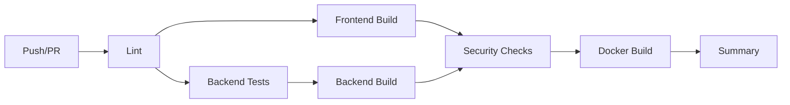
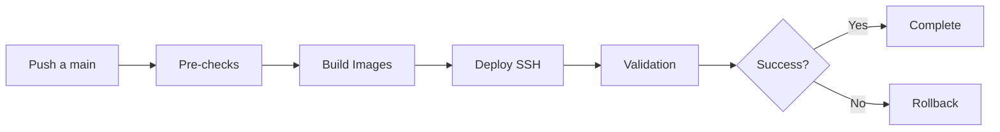

# 🚀 Guía de Configuración CI/CD - MW Panel

## 📋 Resumen

Este documento describe la configuración del sistema CI/CD implementado para MW Panel usando GitHub Actions.

## 🎯 Objetivos Logrados

1. ✅ **Pipeline CI automatizado** con linting, tests y builds
2. ✅ **Validación de PRs** con checks de calidad
3. ✅ **Deployment automatizado** a producción
4. ✅ **Dependabot** para actualizaciones de seguridad
5. ✅ **Templates y CODEOWNERS** para mejor gestión

## 📁 Archivos Creados

```
.github/
├── workflows/
│   ├── ci.yml              # Pipeline principal de CI
│   ├── pr-checks.yml       # Validaciones específicas de PRs
│   └── deploy.yml          # Deployment a producción
├── dependabot.yml          # Configuración de Dependabot
├── pull_request_template.md # Template para PRs
└── CODEOWNERS             # Propietarios del código
```

## 🔧 Configuración Requerida en GitHub

### 1. Secrets del Repositorio

Navega a `Settings > Secrets and variables > Actions` y agrega:

```yaml
# Para deployment SSH
PRODUCTION_HOST: IP_DEL_SERVIDOR
PRODUCTION_USER: root
PRODUCTION_SSH_KEY: (clave SSH privada completa)
PRODUCTION_PORT: 22 (opcional si es diferente)

# Opcional para notificaciones
SLACK_WEBHOOK: https://hooks.slack.com/services/...
```

### 2. Configuración de Branches

En `Settings > Branches`:

1. **Proteger rama `main`/`master`**:
   - ✅ Require PR reviews before merging
   - ✅ Require status checks to pass
   - ✅ Require branches to be up to date
   - ✅ Include administrators

2. **Status checks requeridos**:
   - `lint`
   - `test-backend`
   - `build-frontend`
   - `build-backend`

### 3. Environments

En `Settings > Environments`, crear:

- **production**: Con protección y reviewers requeridos

## 📊 Flujos de Trabajo

### 1. CI Pipeline (`ci.yml`)

Se ejecuta en cada push y PR:



**Características**:
- Linting paralelo de backend y frontend
- Tests con PostgreSQL y Redis reales
- Cobertura de código con Codecov
- Análisis de seguridad
- Build de imágenes Docker

### 2. PR Checks (`pr-checks.yml`)

Validaciones adicionales para PRs:

- **Título semántico**: feat/fix/docs/etc
- **Nombre de branch**: feature/*, fix/*, etc
- **Tamaño del PR**: Etiquetas XS/S/M/L/XL
- **Console.log detection**: Advierte sobre logs
- **TODO/FIXME**: Lista comentarios pendientes
- **Cobertura**: Reporte en el PR

### 3. Deploy Pipeline (`deploy.yml`)

Deployment automatizado a producción:



**Características**:
- Backup automático antes de deploy
- Cache busting incluido
- Health checks post-deploy
- Rollback automático en caso de fallo

## 🎮 Uso del Sistema

### Para Desarrolladores

1. **Crear nueva feature**:
   ```bash
   git checkout -b feature/nueva-funcionalidad
   git push -u origin feature/nueva-funcionalidad
   ```

2. **Abrir PR**:
   - Usa el template proporcionado
   - Espera los checks automáticos
   - Solicita review cuando pase todo

3. **Ver estado del CI**:
   - En el PR: pestaña "Checks"
   - En Actions: workflows en ejecución

### Para Administradores

1. **Monitorear deployments**:
   - GitHub Actions > workflow "Deploy to Production"
   - Revisa logs en tiempo real

2. **Rollback manual** si es necesario:
   ```bash
   ssh user@server
   cd /opt/mw-panel
   git reset --hard HEAD~1
   ./start-all-optimized.sh --restart
   ```

## 🔍 Troubleshooting

### CI Fallando

1. **Lint errors**:
   ```bash
   # Arreglar automáticamente
   npm run lint:fix
   ```

2. **Tests fallando**:
   ```bash
   # Ejecutar localmente
   npm test
   ```

3. **Build fallando**:
   ```bash
   # Verificar build local
   npm run build
   ```

### Deploy Fallando

1. **SSH connection refused**:
   - Verifica el secret `PRODUCTION_SSH_KEY`
   - Confirma que la IP es correcta

2. **Health check fallando**:
   - Revisa logs del servidor
   - Verifica que nginx esté corriendo

## 📈 Mejoras Futuras

1. **Tests E2E con Cypress**:
   ```yaml
   - name: Run E2E tests
     run: npm run test:e2e
   ```

2. **Preview Deployments**:
   - Usar Vercel/Netlify para PRs
   - O configurar servidor de staging

3. **Notificaciones**:
   - Slack/Discord webhooks
   - Email en deploy exitoso

4. **Métricas**:
   - Bundle size tracking
   - Performance budgets
   - Lighthouse CI

## 🎯 Beneficios del CI/CD

1. **Calidad de Código**:
   - ✅ No se puede mergear código que no pase tests
   - ✅ Linting consistente
   - ✅ Sin console.logs en producción

2. **Seguridad**:
   - ✅ Dependabot para vulnerabilidades
   - ✅ Secrets scan automático
   - ✅ npm audit en cada build

3. **Productividad**:
   - ✅ Deploy automático al mergear
   - ✅ Rollback automático si falla
   - ✅ No más deploys manuales

4. **Visibilidad**:
   - ✅ Estado claro de cada PR
   - ✅ Historial de deployments
   - ✅ Logs centralizados

## 🚦 Estado Actual

- ✅ CI Pipeline configurado y funcional
- ✅ PR checks implementados
- ✅ Deploy pipeline listo
- ✅ Dependabot activo
- ⏳ Falta configurar secrets en GitHub
- ⏳ Falta habilitar branch protection

## 📝 Notas Finales

El sistema CI/CD está completamente configurado pero requiere:

1. Agregar los secrets en GitHub
2. Habilitar las protecciones de branch
3. Hacer el primer deployment de prueba

Una vez configurados los secrets, el sistema funcionará automáticamente en cada push y PR.